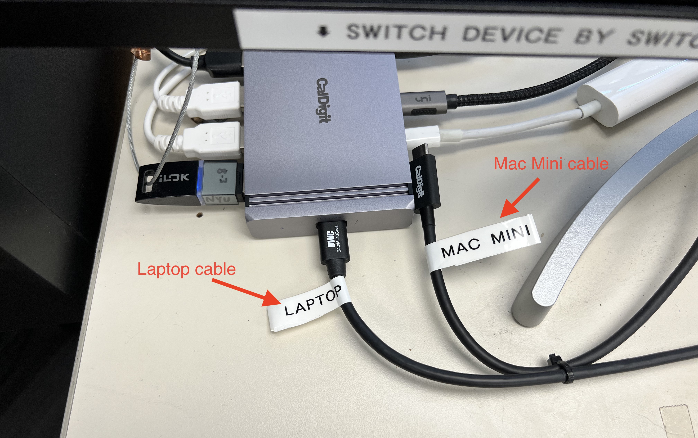
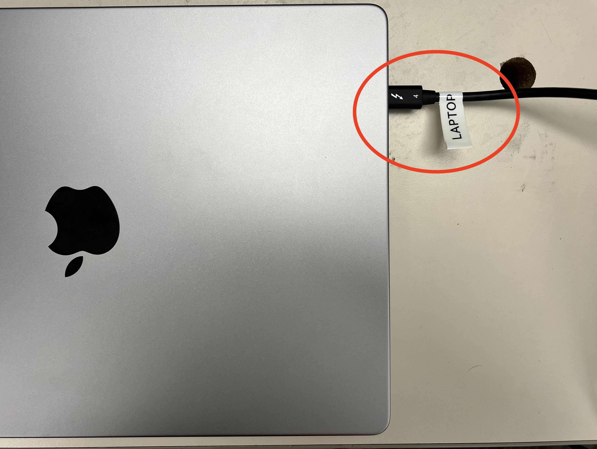

# Quick Start

Here's how to get set up with the *one cable solution* for the film scoring desks. This quick start guide applies to room **302A**, **302B**, **302D**, **303A**, and **774\***. 

\*As of writing this document, room **774** can only be used in Laptop Mode. 

---

## Step 1 - *Connect the Cable*

<!-- > *Picture of the CalDigit hub will go here with both **LAPTOP** and **MAC MINI** cables visible and circled in red*. -->

Notice the CalDigit Thunderbolt Hub located under the computer monitor. There should be a Thunderbolt cable plugged in labeled **LAPTOP** or **MAC MINI**. If you want to use your personal laptop with the desk, connect the **LAPTOP** cable, and if you want to use the computer that comes with the desk, connect the **MAC MINI** cable.

---

## Step 2 - *Setup the Device*

### Laptop Mode

Trace the **LAPTOP** cable that you plugged into the hub to it's other end. You should find that this end is also labeled **LAPTOP**. Plug this end of the cable into your laptop. Your device should be quickly recognized and be connected to everything on the desk.

### Mac Mini Mode

Prompt the computer to wake by pressing keys on the keyboard or moving the mouse around. The computer screen should appear on the monitor.

---

## Tips & Tricks

1. When **LAPTOP** is connected, and you are on a Macbook, you can go to ***System Preferences>Displays*** to adjust the screen resolution or mirroring options.
2. If you are not seeing `Universal Audio Thunderbolt` as an audio output device, make sure you have the necessary [drivers](https://www.uaudio.com/downloads/uad) installed. Conversely, you can connect the 3.5mm aux jack to your computer's headphone port.